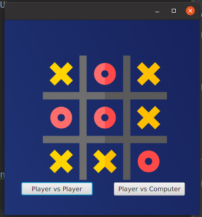
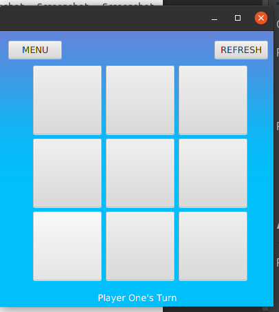
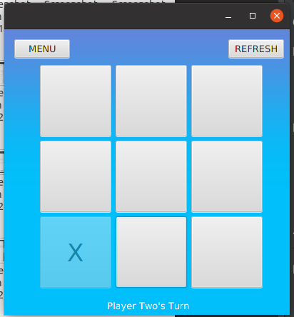
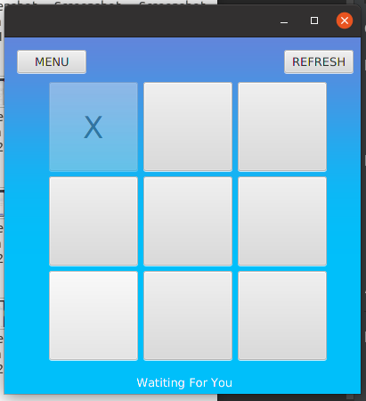
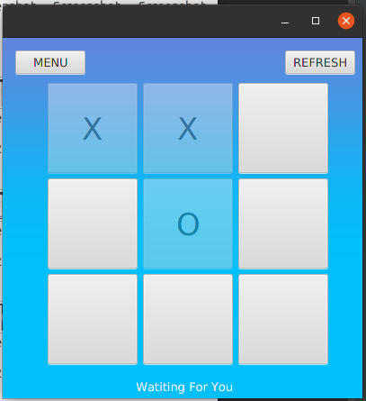
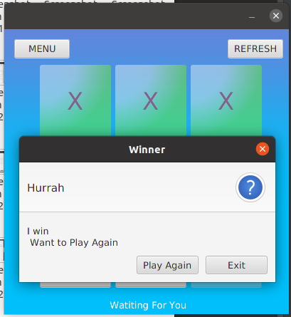
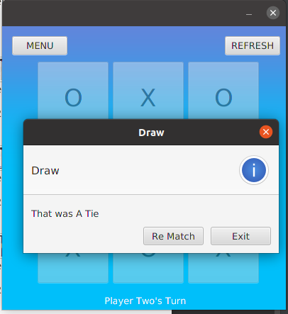

# ASSUMPTION
1.  Player Vs Machine Player will be the second player. 
2.  Once a Grid is marked it cannot be unmarked.

# TECH STACK
___________________________

For Development
* JAVA 14
* JAVAFX 11

For Testing
* JAVA 14
* TESTFX 4.0.6\
Note
  If using JDK 8 Then It is not necessary to download JAVAFX
  as it is bundled.
#DEVELOPMENT & TEST PURPOSE
* START PPOJECT WITH MAVEN
* USE **mvn clean javafx:run** for running the application.
* use **mvn test** for Testing the application \
* If Error for JAVAFML Not Found Occurs Download fxml directly from
* https://openjfx.io/
* And add it to run Configuration in place of $PATH_TO_FX$

# APPLICATION
Application Start with an welcome page having two option
* Player vs Player\
  *Player vs Computer\
  
###In Player vs Player
A label at bottom of the screen for Players Turn. \
Players Need to Click On the Grid \
 \
\
### In Player Vs Computer.
Computer gets the first Turn. \
 \

For Win , Tie Alert Box generated with Option to:
* Play Again
* Exit

 \

#RESOURCE && IDEA
For JavaFX Java Documentation was the best source. \
In testing TestFX doesn't have a great documentation so used a mix of Junit and TestFx. \
Used MinMax Algorithm for Computer Decision but can be easily \
replaces by any algorithm without changes
in major portion of the code.

